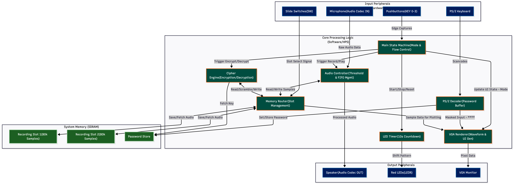
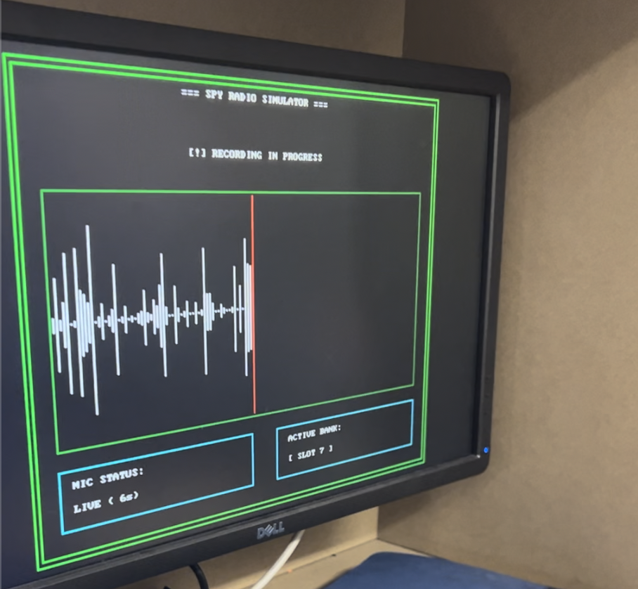
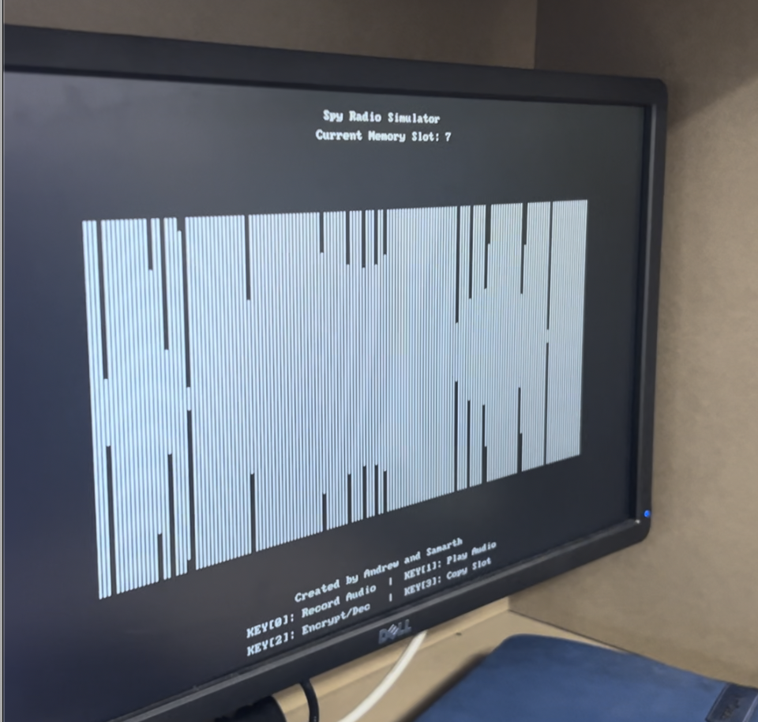
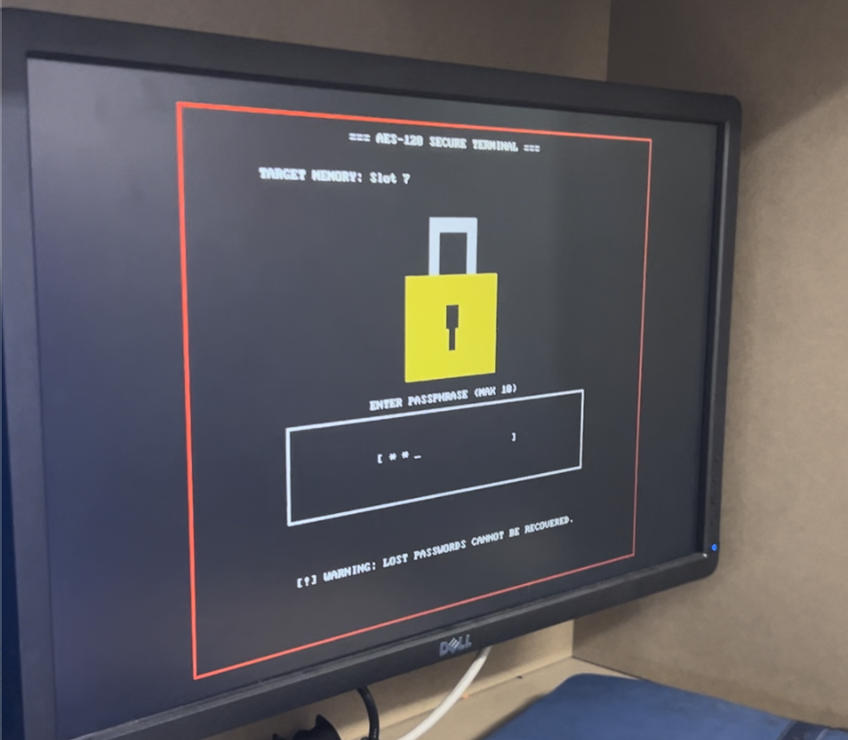
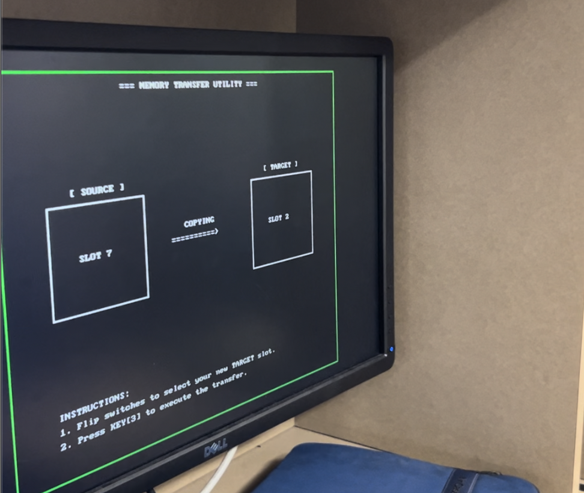

# 📻 Bare-Metal Audio Encryption System (RISC-V)


A bare-metal, real-time secure audio recording, encryption, and playback station engineered in C for a soft-core **RISC-V processor** on the **Intel Cyclone V SoC (DE1-SoC)**. 

The system implements low-level register MMIO drivers to interface directly with the onboard Wolfson WM8731 audio codec, PS/2 keyboard controller, VGA character/pixel buffers, and pushbuttons via Machine-Mode hardware interrupts. Encrypted audio is scrambled using a custom **AES-128 Counter (CTR) Mode** stream cipher keyed via PS/2 password authentication.


---

## 🎥 Hardware Demonstration

* **Real Hardware Execution:** [Download & View Demo Video (project_demo_video.mp4)](./project_demo_video.mp4)

---

## 🏛️ System Architecture

The firmware runs bare-metal without an operating system, executing machine instructions directly against memory-mapped hardware peripheral controllers mapped across the 32-bit address space.



### Key Architectural Modules
* **Machine-Mode CSR Interrupt Handler:** Vector-intercepted hardware interrupts servicing edge-triggered pushbutton inputs via `mtvec`, `mcause`, `mie`, and `mstatus`.
* **Voice-Activated Audio Driver:** FIFO-managed DMA-like polling loops that monitor acoustic threshold levels to trigger autonomous 10-second stereo audio captures.
* **AES-128 CTR Stream Cipher Engine:** Real-time 128-bit block transformation applied as an additive XOR stream cipher over stereo audio memory buffers.
* **Dual-Buffer VGA Driver:** Direct VRAM frame-buffer rendering (320×240 RGB565 graphics) layered with an 80×60 memory-mapped ASCII character generator.
* **10-Slot Bank Storage Manager:** Multi-channel memory banking allowing slot-to-slot audio transfer and duplication through hardware switches `SW[9:0]`.

---

## 🔐 Cryptographic Engine: AES-128 CTR

The firmware implements the complete NIST Advanced Encryption Standard specification operating in **Counter (CTR) Mode**:

### 1. Zero-Latency Stream Transformation
Standard ECB/CBC block modes require block padding and introduce latency unsuitable for continuous streaming audio. CTR mode transforms AES into an **additive stream cipher**:
$$C_i = P_i \oplus \text{AES}_{K}(\text{Nonce} \parallel \text{Counter}_i)$$
* Encryption and decryption routines are mathematically identical: applying the same passphrase against scrambled audio runs the identical CTR keystream generation, XOR-restoring the original PCM waveform.
* Processes $80{,}000$ stereo audio samples per slot across 20,000 counter block increments without memory leaks or buffer overflows.

### 2. Key Derivation & Expansion
* **Passphrase Ingestion:** Passwords up to 10 characters are entered via a PS/2 keyboard interface and scrambled using an **FNV-1a 32-bit hash** with non-linear bitwise spreading across 16 bytes.
* **10-Round Key Expansion:** Expands the 16-byte master key into 176 bytes of round keys utilizing Rijndael S-box byte substitution, cyclic word rotations, and round constants ($R_{\text{con}}$).
* **Galois Field Arithmetic:** Column diffusion is evaluated over $GF(2^8)$ utilizing an optimized `xtime()` bitwise multiplier polynomial ($x^8 + x^4 + x^3 + x + 1 \equiv \text{0x11B}$).

---

## ⚡ Hardware Architecture & MMIO Map

The system bypasses operating system abstractions, reading and writing to physical registers via volatile pointers:

| Subsystem / Peripheral | Base Address | Register Offset / Width | Functionality |
| :--- | :--- | :--- | :--- |
| **Audio Core FIFO** | `0xFF203040` | `+0x0` Control, `+0x4` Fifospace, `+0x8` Left, `+0xC` Right | Dual-channel 16-bit PCM read/write FIFO queue |
| **Pushbuttons (KEYs)** | `0xFF200050` | `+0x0` Data, `+0x8` Interruptmask, `+0xC` Edgecapture | Hardware button interrupts and debouncing |
| **Slider Switches (SW)** | `0xFF200040` | 32-bit register (`0x3FF` mask) | Live active memory bank slot selection (0–9) |
| **Red LEDs** | `0xFF200000` | 32-bit register (`0x3FF` mask) | Passkey character count and recording timer countdown |
| **PS/2 Controller** | `0xFF200100` | `+0x0` Data / RVALID bit (`0x8000`) | Make/break scancode stream from keyboard |
| **VGA Pixel Buffer** | `0x08000000` | Address: `Base + (y << 10) + (x << 1)` | 320×240 16-bit RGB565 framebuffer graphics |
| **VGA Character Buffer** | `0x09000000` | Address: `Base + (y << 7) + x` | 80×60 ASCII character text generation overlay |

---

## 🎛️ Bare-Metal Interrupt Control (RISC-V Machine Mode)

Hardware responsiveness is driven through the RISC-V Machine-Mode Control and Status Registers (CSRs):

```c
// Vector base setup to custom ISR
__asm__ __volatile__ ("csrw mtvec, %0" : : "r"(button_isr));

// Unmask External Interrupt 18 (Pushbuttons)
int mie_bits = (1 << 18); 
__asm__ __volatile__ ("csrs mie, %0" : : "r"(mie_bits));

// Global interrupt enable (MIE bit 3 in mstatus)
int mstatus_bits = (1 << 3);
__asm__ __volatile__ ("csrs mstatus, %0" : : "r"(mstatus_bits));
```

### Context Switching in `button_isr()`
The interrupt routine is declared with `__attribute__((interrupt("machine")))`, compelling the compiler to generate automatic context-saving prologues/epilogues across all volatile registers before executing `mret`:
1. Reads `mcause` to isolate exception code 18 (External Pushbutton IRQ).
2. Evaluates the `Edgecapture` register (`0xFF20005C`) to dispatch functions:
   * **KEY[0]:** Initiates voice-activated audio recording into active slot.
   * **KEY[1]:** Starts DAC audio streaming with a real-time VGA playhead.
   * **KEY[2]:** Opens AES Secure Terminal for encryption/decryption passkey entry.
   * **KEY[3]:** Executes fast inter-slot buffer transfers (`memcpy`).
3. Clears edge flags atomically to prevent re-entrant interrupt storms.

---


## 📊 VGA Telemetry & Visual State Machine

The graphical display pipeline continuously monitors system state, rendering custom HUD elements, dynamic audio waveforms, and security dialogs:

### 1. Voice-Activated Audio Capture
Monitors ambient input through the microphone until sample amplitude exceeds the threshold. Once triggered, it captures 80,000 samples at 8 kHz while drawing the live waveform and updating a 10-second countdown on the 10 onboard LEDs and VGA HUD.



### 2. Live Oscilloscope & Memory Slot Inspection
Inspects stored PCM data across all 10 independent slots. Drawing routines plot peak amplitudes relative to the vertical centerline ($y = 120$) in RGB565 color. During playback, a synchronized vertical playhead sweeps across the screen.



### 3. AES-128 Secure Encryption Terminal
Upon asserting KEY[2], the screen shifts to a secure entry terminal. PS/2 make codes (`0x1C`–`0x4D`) are mapped via an ASCII lookup table, rendering masked input asterisks while preventing buffer overruns. Once confirmed with `ENTER` (`0x5A`), the UI turns red while the cipher executes in-place.



### 4. Hardware Slot Transfer Utility
Pressing KEY[3] enters the memory transfer utility. Users select a target bank via physical toggle switches `SW[0]` through `SW[9]`. A second press executes an optimized block transfer (`memcpy`) of the 320 KB stereo buffer between hardware slots.



---

## 🛠️ Hardware Specifications

* **Target Processor:** Soft-Core 32-bit RISC-V Processor (RV32I)
* **Development Platform:** Intel Cyclone V SoC FPGA (DE1-SoC Development Kit)
* **Audio Codec:** Wolfson WM8731 (24-bit DAC/ADC configured for 8 kHz stereo playback)
* **Sampling Depth:** 16-bit signed PCM, 80,000 samples per channel (10 seconds/slot)
* **Storage Allocation:** 10 independent audio slots ($10 \times 80{,}000 \times 4\text{ bytes} \times 2 = 6.4\text{ MB}$ dynamic capacity)
* **Display Output:** 320×240 pixel resolution (16-bit RGB565) + 80×60 character overlay
* **Input Interfaces:** PS/2 Alphanumeric Keyboard, 4× Debounced Pushbuttons, 10× Toggle Switches
* **Toolchain:** RISC-V GNU Toolchain (`riscv32-unknown-elf-gcc`), Intel Quartus Prime

